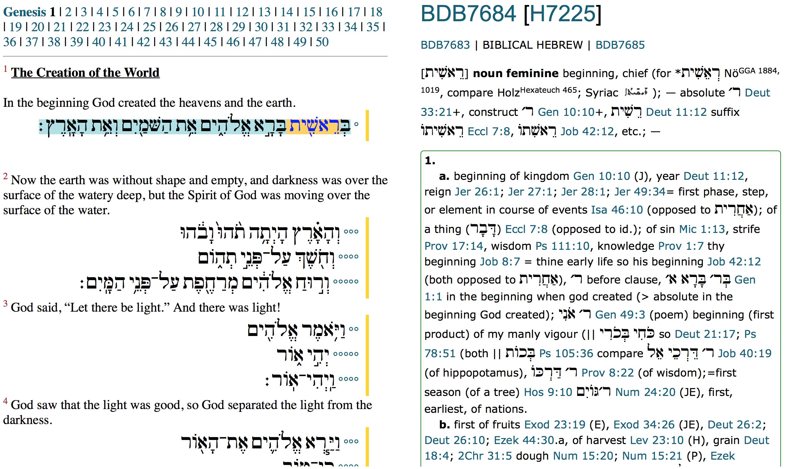

# The Brown-Driver-Briggs Hebrew and English Lexicon

License: public domain document

# Screenshot

# JSON format

This is the file Eliran Wong formatted for use in his iOS app "BibleBento Plus" (<a href='https://itunes.apple.com/us/app/biblebento-plus/id1439743446?mt=8'>https://itunes.apple.com/us/app/biblebento-plus/id1439743446?mt=8</a>)

Source: provided by Tim Morton, the developer of <a href='https://www.bibleanalyzer.com'>Bible Analyzer</a>

Some of bible verse references are corrected by Eliran Wong

# CSV format

This .csv file was created by revising the .json file, with supplementary data provided by John Isett, <a href='https://BibleHub.com'>BibleHub.com</a>.

This .csv file was formatted by Eliran Wong for use in online bilbe reader: <a href='https://marvel.bible'>https://marvel.bible</a>
 A link for testing: <a href='https://marvel.bible/tool.php?bdb=H90_H92_H7225'>https://marvel.bible/tool.php?bdb=H90_H92_H7225</a>

Bible references were parsed by <a href='https://github.com/stephen-ku'>Stephen Ku</a> and his associates, with more than a hundred references corrected by Eliran Wong.

Known issues: need to correct cross-references where &lt;checkingNeeded/&gt; or &lt;wrongReferenceRemoved/&gt; are located.

Bible book abbreviations in all cross-references follow the standard of Society of Biblical Literature: 
1	Gen 
2	Exod 
3	Lev 
4	Num 
5	Deut 
6	Josh 
7	Judg 
8	Ruth 
9	1Sam 
10	2Sam 
11	1Kgs 
12	2Kgs 
13	1Chr 
14	2Chr 
15	Ezra 
16	Neh 
17	Esth 
18	Job 
19	Ps 
20	Prov 
21	Eccl 
22	Song 
23	Isa 
24	Jer 
25	Lam 
26	Ezek 
27	Dan 
28	Hos 
29	Joel 
30	Amos 
31	Obad 
32	Jonah 
33	Mic 
34	Nah 
35	Hab 
36	Zeph 
37	Hag 
38	Zech 
39	Mal 
40	Matt 
41	Mark 
42	Luke 
43	John 
44	Acts 
45	Rom 
46	1Cor 
47	2Cor 
48	Gal 
49	Eph 
50	Phil 
51	Col 
52	1Thess 
53	2Thess 
54	1Tim 
55	2Tim 
56	Titus 
57	Phlm 
58	Heb 
59	Jas 
60	1Pet 
61	2Pet 
62	1John 
63	2John 
64	3John 
65	Jude 
66	Rev 
